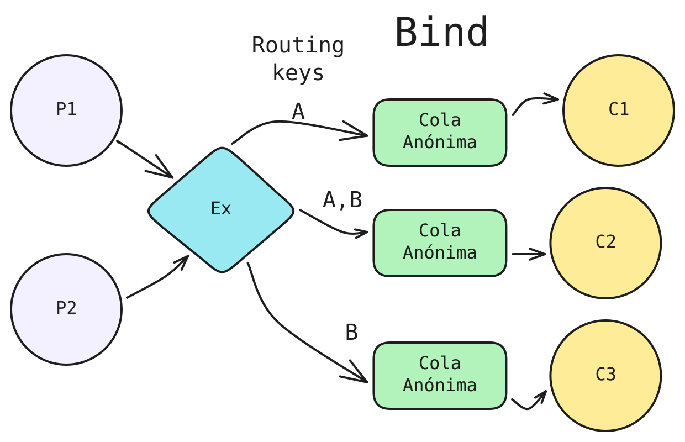

## Middlewares Orientados a mensajes

Dado que se me pide implementar un Middleware con la interfaz definida teniendo en cuenta los siguientes conceptos:

### Exchange: Comportamiento esperado
Este modelo de envío de mensjaes busca aportar una mayor abstracción al productor/consumidor del uso de colas mediante un *Exchange*
intermedio que se encargue de esto último, de esta forma no es necesario mapear una entrada con una salida única.

Ejemplo: En la siguiente imagen se muestran dos productores, y tres consumidores conectados por un exchange.
<p align="center">
  
</p>
El comportamiento esperado sería, que cualquier mensaje producido:
-  Que se rutee por A llegaría al consuidor uno y dos.
- Que se rutee por B llega al consumidor dos y tres.
Es decir que  exchange se encarga de enviar una copia a todas las colas que hayan hecho bind a esa routing key.


#### Inicio de constructor
A la hora de iniciar el middleware con exchange es necesario

### Queue:  Comportamiento esperado
Es el lugar de donde los consumidores agarran los mensajes recibidos. Podemos lograr esto usando las queues que provee RabbitMQ, misma versión que en DockerFile.

Para ello, declaramos una cola asociada al canal con, donde los campos, se asignan de la siguiente forma:
```
_, err = ch.QueueDeclare(queueName, true, false, false, false, nil)
//                                 durable  ad  excl  noWait, autoDelete, args
```
Así nos aseguramos de tener todos el control posible sobre la misma y que además se pueda compartir la cola entre dos Middlewares con coneconexionesxoines distintas.

#### Send
Para lograr enviar un mensaje a la cola asignda usamos `PublishWithContext` y usamos el exchange por defecto
para enviar al nombre de la cola asignado.

#### StartConsuming
Si el mensaje falla se devuelve a la cola pues requeue =true
´´´
 d.Nack(false, true)
 //     multiple, requeue
´´´